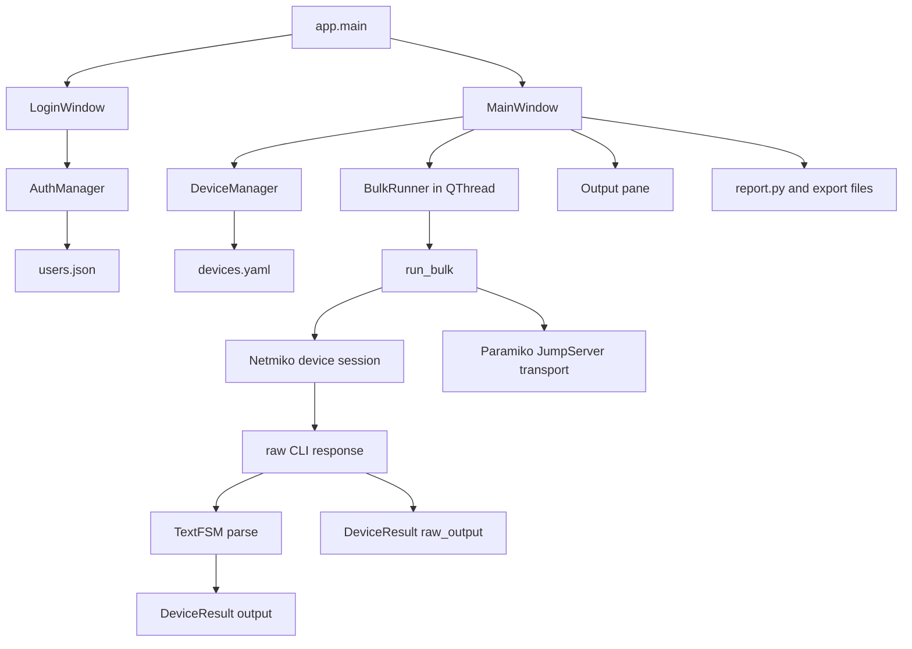

# ISP NetOps Automation Tool
## Developer Technical Guide

**Audience:** software engineers, network automation engineers, security reviewers, release engineers, and technical leads  
**Status:** living engineering document  
**Last reviewed:** 2026-09-15

## 1. Purpose and Scope

This document explains how the application works, how to install and operate it in a development environment, how to troubleshoot common failures, and how a developer should extend or remove features without breaking security or operational behavior.

The application is a Windows-oriented PySide6 desktop tool for controlled, read-only command collection from Cisco, Huawei, and Nokia network devices. It stores local inventory and account data, connects through Netmiko and Paramiko, supports an optional SSH JumpServer, parses output with TextFSM where templates exist, and exports parsed, raw, and summary artifacts.

This guide describes the current implementation. It does not claim that the project is a complete centralized ISP management platform.

## 2. Product Boundaries

### Current responsibilities

- Local operator authentication and optional TOTP MFA
- Local encrypted device and JumpServer credential storage
- Device inventory management and CSV onboarding
- Multi-vendor SSH command execution
- Optional JumpServer proxy routing
- In-app SSH host-key fetch/trust enrollment
- Safe-mode filtering for obvious disruptive commands
- Parsed and raw output preservation
- Layered MPLS/VPN path validation (IGP/MPLS/LSP/BGP/MP-BGP-VPN) against real devices
- Operational reports and exports
- Local audit logging

### Explicit non-responsibilities

- Full network monitoring or telemetry collection
- Centralized identity, SSO, or enterprise RBAC
- Configuration management or automated change deployment
- Long-term time-series storage
- Distributed job scheduling
- High-availability control-plane services
- A replacement for an ISP ITSM, NMS, or configuration platform

These boundaries matter when evaluating new feature requests. A request that introduces centralized scheduling, shared tenancy, or write operations is an architectural expansion, not a small GUI enhancement.

## 3. Repository Layout

```text
app/
  main.py                         Application entry point
  config.py                       App-data paths, policy constants, atomic writes
  auth/
    auth_manager.py               Local users, bcrypt, lockout, MFA secret state
    mfa_manager.py                TOTP secret and verification helpers
  core/
    command_runner.py             Netmiko execution, Paramiko proxying, results
    command_safety.py             Safe-mode command filtering
    deployment_policy.py          Managed-laptop/jumpserver-only org safety defaults
    device_manager.py             Device model, encrypted inventory, CSV import
    jump_server.py                JumpServer configuration and persistence
    host_key_manager.py           Fetch/trust SSH host keys without authenticating
    report.py                     Parsed/raw report formatting and summary reports
    vendors.py                    User vendor names to Netmiko device types
    validation/
      engine.py                   Layered IGP/MPLS/LSP/BGP/VPN validation against real devices
      command_profiles.py         Per-vendor/platform/stage command profiles
      parsers.py                  Stage output -> pass/fail/unknown + evidence
      models.py                   ValidationRequest/StageResult/ValidationResult dataclasses
  gui/
    login_window.py               Login, first-run account setup, MFA flow
    main_window.py                Device list, run controls, result display/export
    device_dialog.py              Add/edit device form and validation
    jump_server_dialog.py         JumpServer configuration and test action
    host_key_dialog.py            In-app SSH host-key fetch/trust flow
    validation_dialog.py          MPLS path validation dashboard
    mfa_window.py                 MFA enrollment and verification dialogs
  utils/
    crypto.py                     Fernet encryption/decryption
    audit_log.py                  Rotating local audit log

tests/
  test_command_runner.py          Mocked execution, SSH safety, and error-message tests
  test_command_safety.py          Safe-mode false-positive/blocking coverage
  test_deployment_policy.py       Org safety-default coverage
  test_device_import.py           CSV template coverage
  test_device_validation.py       Inventory validation coverage
  test_host_key_manager.py        Host-key fetch/trust coverage
  test_output_view.py             GUI output-selection and run-progress coverage
  test_report.py                  Parsed/raw/report format coverage
  test_run_settings.py            Concurrency/timeout GUI-control coverage
  test_validation_engine.py       Validation engine stage/device orchestration coverage
  test_validation_parsers_fixtures.py  Fixture-based parser coverage per vendor/stage

README.md                         Development setup and user-facing overview
NOC_OPERATOR_MANUAL.md            NOC runbook and method of procedure
ISP_NETOPS_PRODUCT_OVERVIEW.md    ISP customer/product document
DEVELOPER_TECHNICAL_GUIDE.md      This engineering handoff document
requirements.txt                  Runtime and test dependencies
.gitignore                        Local secret/report exclusion rules
```

## 4. Runtime Architecture

The application is a local Qt process. There is no HTTP API or background service in the current design.



### Important thread boundary

Qt widgets must only be accessed from the GUI thread. `MainWindow` starts a `QThread`, moves `BulkRunner` into it, and receives results through Qt signals. Network operations must remain in the worker path. A new feature must never update a widget directly from `run_bulk()` or `run_commands_on_device()`.

### Result flow

1. The GUI collects checked devices and non-empty command lines.
2. Safe mode filters commands before any worker starts.
3. `BulkRunner.run()` calls `run_bulk()` in the worker thread.
4. `run_bulk()` submits one future per device to a bounded `ThreadPoolExecutor`.
5. Each device opens one Netmiko session, runs each command once, and captures raw text.
6. Raw text is parsed locally when a TextFSM template is available.
7. A `DeviceResult` is emitted as each device finishes.
8. The GUI adds a results row and displays the first result automatically.
9. Completion enables export and saves an automatic report.

## 5. Data and Secret Storage

The application data directory is normally:

```text
%APPDATA%\ISPNetOpsTool\
```

Files include:

```text
users.json       Local users, bcrypt hashes, MFA metadata, lockout state
devices.yaml     Device inventory with encrypted password/secret fields
jumpserver.yaml  JumpServer configuration with encrypted password
secret.key       Fernet key used by the current local installation
known_hosts      Verified SSH host keys used by strict connections
reports/         Automatically saved run reports
*.log            Rotating audit log
```

### Security implications

The current encryption model protects secrets at rest from casual inspection, but the Fernet key is stored on the same workstation as the ciphertext. Anyone who obtains both may decrypt the stored credentials. Production deployment should consider Windows DPAPI, Credential Manager, a managed secret vault, or a central service with a stronger key lifecycle.

Never commit any of these files. The `.gitignore` excludes local inventories, reports, credentials, host keys, common key formats, and secret-like filenames. Recheck the ignore rules before every public release.

### Persistence rules

- Use `yaml.safe_load`, never unsafe YAML loading.
- Validate the top-level data shape before constructing dataclasses.
- Use `atomic_write_text` for local writes so an interrupted write does not leave a half-written primary file.
- Raise `StorageError` for recoverable local-store failures and show a user-facing startup message.
- Preserve backward compatibility when adding fields by providing dataclass defaults or a migration.

## 6. SSH and JumpServer Security

### Host-key verification

Direct device connections use Netmiko strict host-key options and the application `known_hosts` file. JumpServer connections use Paramiko with system host keys plus the application host-key file and reject unknown keys.

This intentionally prevents silent trust of a new host. **Host Keys > Trust SSH Host Key...** in the main window provides this enrollment workflow: it negotiates the SSH transport handshake (via `host_key_manager.fetch_host_key`) without authenticating, displays the key type and SHA256 fingerprint, requires an explicit operator confirmation, writes the trusted entry to `known_hosts`, and records a `host_key_trusted` audit event. It supports fetching through the configured JumpServer as well as directly, mirroring the proxied-channel pattern `run_bulk()` uses.

### Legacy device algorithms

Some older Cisco devices expose `ssh-rsa` host keys and SHA-1 Diffie-Hellman KEX algorithms. Do not globally weaken SSH policy to accommodate them. Prefer a per-device compatibility profile with an explicit approval, audit event, and documented retirement plan.

### Connection debugging order

1. Confirm DNS/IP and TCP/22 reachability from the relevant network location.
2. If using the JumpServer, test reachability from that server, not only Windows.
3. Confirm the target host key is present for the exact address used by the app.
4. Confirm vendor mapping and SSH port.
5. Confirm credentials and privilege/enable requirements.
6. Inspect the specific error category in the results table.

## 7. Installation and Development Setup

### Requirements

- Windows workstation for the supported desktop workflow
- Python 3.11+ recommended
- Access to the network management path or JumpServer
- A supported SSH-capable device for live testing
- Git and GitHub CLI only if contributing or publishing

### Fresh setup

```powershell
cd "C:\Python_WorkSpace\Xamak Projects\python tool"
python -m venv .venv
.\.venv\Scripts\Activate.ps1
python -m pip install --upgrade pip
python -m pip install -r requirements.txt
```

### Start the GUI

```powershell
.\.venv\Scripts\python.exe -m app.main
```

Use the virtual-environment interpreter explicitly. Running `python -m app.main` with a different system interpreter can fail with missing `PySide6` or other dependencies.

### Run tests

```powershell
$env:QT_QPA_PLATFORM = 'offscreen'
.\.venv\Scripts\python.exe -m pytest -q
```

The suite must pass before merging or publishing. Current coverage is focused and does not replace live multi-vendor integration testing.

### Packaging

The current packaging direction is PyInstaller:

```powershell
python -m pip install pyinstaller
pyinstaller --noconfirm --windowed --onefile --name ISP-NetOps-Tool `
  --collect-all netmiko --collect-all ntc_templates `
  app/main.py
```

Validate the packaged executable on a clean test workstation. In particular, verify Qt plugins, Netmiko drivers, TextFSM templates, AppData creation, and host-key loading.

## 8. Feature Extension Recipes

### Add a supported vendor

1. Add the user-facing name and Netmiko type to `app/core/vendors.py`.
2. Confirm the Netmiko driver exists in the pinned dependency version.
3. Add the vendor to documentation and CSV examples.
4. Test connection parameter construction without a live device.
5. Run a live read-only command against a lab device.
6. Add parser fixtures for commands with TextFSM templates.
7. Add raw-output tests for commands without templates.
8. Update the NOC manual with vendor syntax and failure modes.

Do not scatter vendor strings across the GUI. The vendor map should remain the source of truth.

### Add a command profile

A command profile should be an explicit, named data structure containing:

- Profile name
- Vendor/platform applicability
- Read-only commands
- Expected output or parser support
- Timeout guidance
- Operational purpose

Profiles should be validated before execution and visible in the audit record. Do not hide a large command list in a GUI callback.

### Add a new export format

Keep formatting in `app/core/report.py`, not in Qt event handlers. Define whether the format contains parsed output, raw output, metadata, or references to separate files. Add a fixture-based test that asserts exact headers and representative content. Never include credentials or secrets.

### Add a new GUI control

1. Add the widget in the relevant UI construction method.
2. Keep the handler small and delegate domain work to `core` modules.
3. Disable controls while a run is active if the action could corrupt state.
4. Use signals for worker-to-GUI communication.
5. Add an offscreen Qt test when behavior affects visible output or state.
6. Update the NOC manual and product document if operators will see it.

### Remove a feature

1. Identify public entry points, menu actions, signals, persistence fields, docs, and tests.
2. Add a migration path if stored data contains the feature.
3. Remove the GUI entry point before deleting the core implementation.
4. Keep a clear error for old configuration rather than silently ignoring dangerous settings.
5. Remove stale documentation and tests.
6. Run the full suite and inspect packaged startup.

## 9. Testing Strategy

### Unit tests

Use unit tests for deterministic logic:

- Vendor mapping
- Safe-mode filtering
- Host/device validation
- CSV import and duplicate handling
- Report formatting
- Encryption round trips with isolated test paths
- Lockout calculations

### Mocked network tests

Mock `ConnectHandler` and Paramiko boundaries. Test:

- Successful command execution
- Parsed output and raw output capture
- Authentication failure
- Timeout
- Missing host key
- JumpServer tunnel failure
- Cancellation before connect
- Cancellation between commands
- Retry selection behavior

Tests must never require production credentials or a live router.

### Integration tests

Maintain a controlled lab test matrix for at least one supported platform per vendor family. Capture sanitized fixtures for:

- SSH negotiation
- Privileged mode
- Representative commands
- Parser-supported commands
- Parser-unsupported commands
- Jump-server routing

### Release checks

Before release:

- Run the complete test suite.
- Run import and syntax diagnostics.
- Check `git diff` and staged file list.
- Verify no local reports, keys, credentials, or inventories are staged.
- Test a fresh AppData directory.
- Test a corrupt local store and confirm the user-facing error.
- Test packaged startup.
- Test host-key verification with both trusted and unknown keys.
- Update the operator and product documentation.

## 10. Troubleshooting Guide

### `ModuleNotFoundError: No module named PySide6`

The wrong Python interpreter was used. Run:

```powershell
.\.venv\Scripts\python.exe -m pip install -r requirements.txt
.\.venv\Scripts\python.exe -m app.main
```

### `Server '<host>' not found in known_hosts`

The device is reachable but its host key is not trusted. Obtain and verify the key through an approved channel, add it to `%APPDATA%\ISPNetOpsTool\known_hosts`, and retry. Do not disable strict verification as a shortcut.

### `No route to host` or TCP timeout

Check the network path from the correct location. For a proxied device, Windows only needs to reach the JumpServer; the JumpServer must reach the router.

### `Authentication failed`

Verify the device account, AAA policy, password, and optional enable secret. Avoid repeated guessing because device or account lockout policies may apply.

### `SSH host-key or protocol error`

Check for an unexpected key change, unsupported legacy algorithm, or malformed `known_hosts` line. Confirm the device key fingerprint with the network owner.

### Empty Output pane

Select a results row. The current implementation also selects the first arriving result automatically. If the table contains no result, inspect the run status and worker error first.

### Parser output is raw text

TextFSM only structures commands for which a matching template exists. Raw output is intentional for unsupported commands. Add or validate a parser template before changing the execution path.

### App fails during startup with local data error

Back up the affected file under `%APPDATA%\ISPNetOpsTool\`, inspect its JSON/YAML shape, and restore a known-good backup or recreate only the affected store according to the data-retention policy. Do not delete `secret.key` casually; doing so makes existing encrypted data unreadable.

## 11. Standards Assessment

### Good current practices

- Layered separation between GUI, core execution, persistence, auth, and utilities
- Safe YAML loading
- Bcrypt password hashing
- Fernet encryption for local secrets
- Strict SSH host-key verification
- Bounded concurrency
- Cooperative cancellation
- Atomic local writes
- Dedicated report formatting
- Mocked network boundary tests
- Fixture-based parser regression coverage across all vendor/stage combinations
- Documentation for operators and product stakeholders
- GitHub exclusion rules for local secrets and router data
- Live per-device run progress
- In-app SSH host-key enrollment with audit logging
- Consistent, actionable device-error categorization shared by the bulk-run and validation paths

### Gaps before broad ISP production deployment

- No centralized identity or RBAC enforcement
- Local encryption key shares the same workstation boundary as ciphertext
- No formal schema migration framework
- No centralized audit log or tamper-evident event store
- No live integration test matrix in CI
- No automated dependency vulnerability scanning
- No signed release/update process
- Safe mode remains pattern-based rather than a vendor-aware allowlist
- No formal threat model or security review record
- No performance baseline for large inventories and jump-server channel limits

The code is maintainable for a small team and a controlled desktop product. It is not yet a full enterprise SaaS architecture. That distinction should shape both roadmap promises and subscription packaging.

## 12. Engineering Standards for Future Work

- Keep domain logic out of Qt callbacks.
- Prefer typed dataclasses and explicit return values.
- Use descriptive names; avoid one-letter variables.
- Keep public behavior backward compatible unless a migration is included.
- Add a focused test before or alongside every behavior change.
- Never log passwords, MFA secrets, private keys, or full credential-bearing connection parameters.
- Treat raw router output as potentially sensitive.
- Do not weaken SSH verification to make a test pass.
- Keep comments for security boundaries, thread boundaries, parser fallbacks, and non-obvious compatibility behavior.
- Avoid comments that merely repeat the next line of code.
- Update all three documentation layers when appropriate:
  - Developer technical guide
  - NOC operator manual
  - ISP product overview

## 13. Suggested Next Engineering Milestones

1. Add vendor-aware SSH compatibility profiles for legacy devices.
2. Add jump-server integration tests using a local Paramiko fixture.
3. Add structured JSON export with a versioned schema.
4. Add a robust cancellation state machine (per-device progress landed; see Host-key verification section for the enrollment UI, also landed).
5. Move secrets to Windows DPAPI or a managed secret provider.
6. Add CI with tests, linting, dependency scanning, and packaging smoke tests.
7. Add a formal migration layer for local stores.
8. Add role enforcement and centralized audit collection for team deployments.

## 14. Handoff Checklist

A new developer should be able to:

- Create the virtual environment and install dependencies.
- Start the GUI with the correct interpreter.
- Run the complete test suite.
- Explain the QThread to worker-to-signal result flow.
- Add a device without exposing credentials.
- Configure a JumpServer and known-host trust.
- Trace a device result from Netmiko through `DeviceResult` to the Output pane and export.
- Add a vendor or parser fixture safely.
- Diagnose a missing host key, timeout, authentication failure, parser fallback, and corrupt local store.
- Update the operator manual and product overview for a user-visible feature.
- Confirm that local secrets and reports are excluded before pushing to GitHub.

## 15. Document Maintenance

Update this guide when any of the following changes:

- A module or persistence file is added or removed
- A security boundary changes
- A vendor or transport is added
- A report format changes
- A new deployment or packaging method is introduced
- A feature changes operator workflow
- A known troubleshooting method changes
